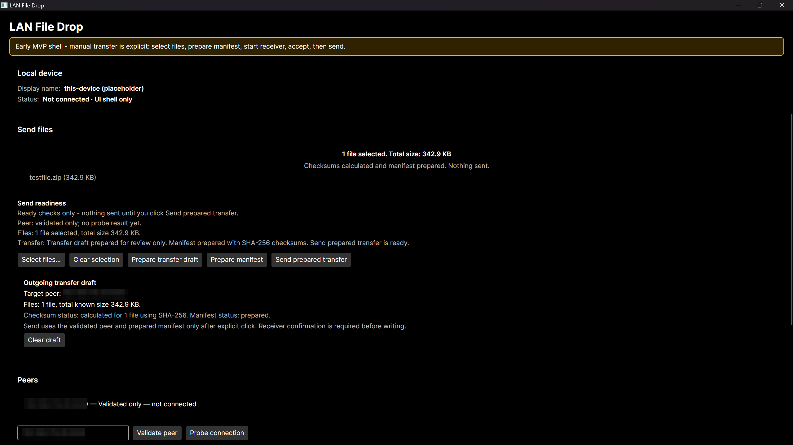
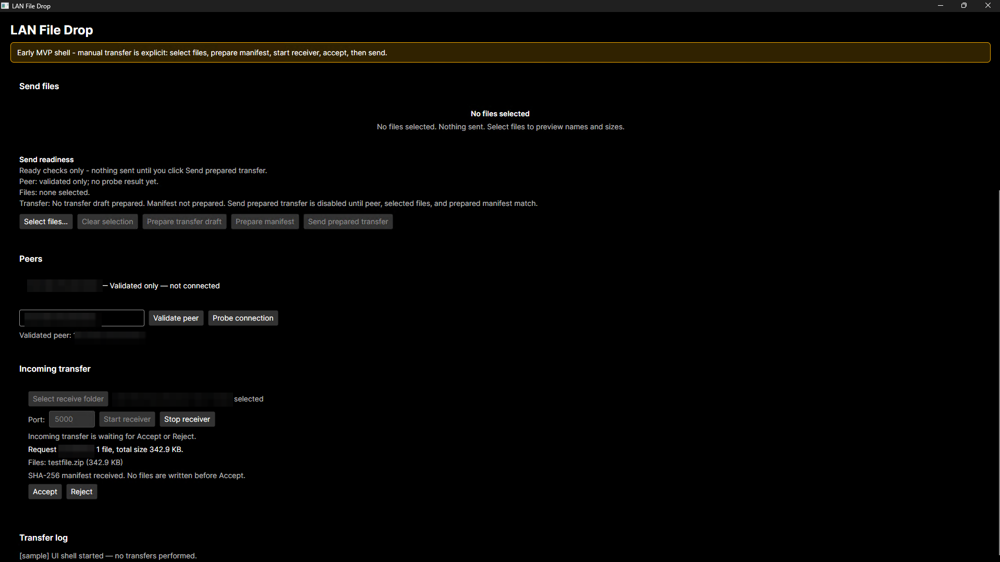
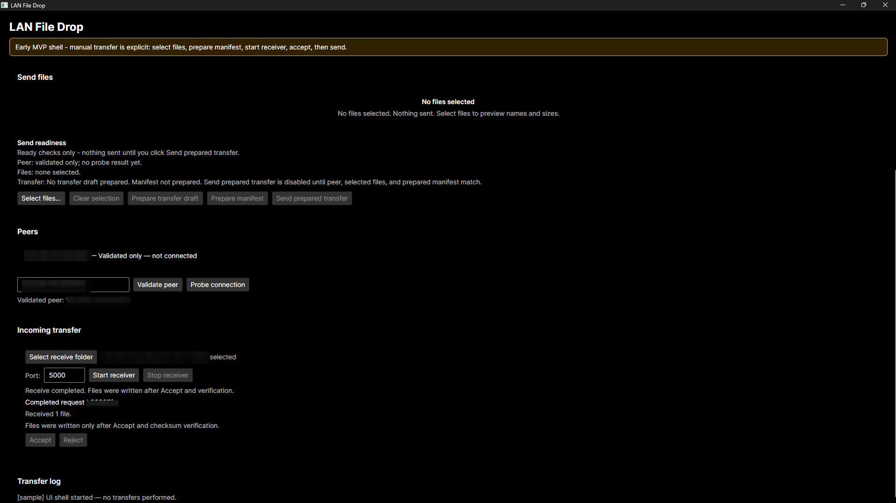
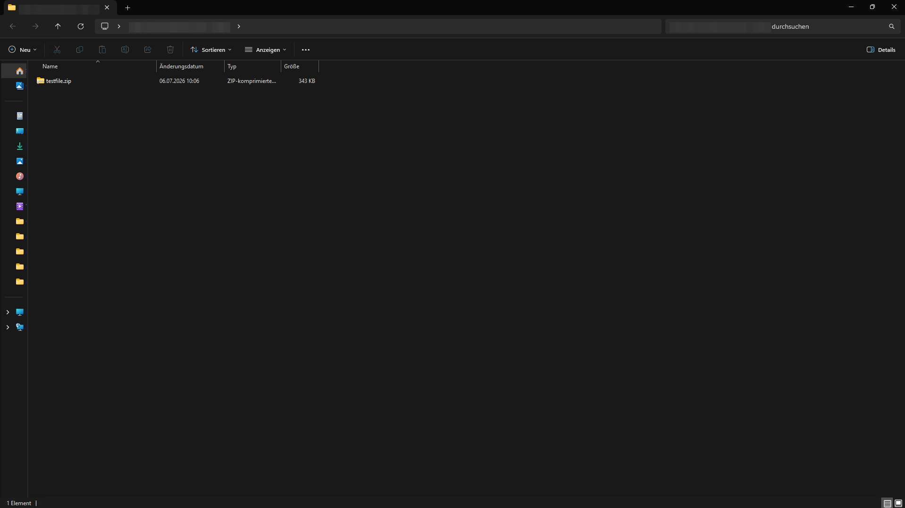

# LAN File Drop

[](https://github.com/Duly330AI/lan-file-drop/actions/workflows/ci.yml)

A safe, boring LAN-only file transfer app for trusted devices — no cloud, no SMB, no admin rights, no credentials.

Send a file from one Windows PC to another on the same local network: the sender
selects files and prepares a checksummed manifest, the receiver must explicitly
click **Accept** before anything is written to disk, and every received file is
verified against its SHA-256 checksum. Built in C# / .NET with a strict
Core / Networking / UI separation and unit-tested transfer logic.

> **MVP status:** Working technical MVP for manual peer transfer.
> The full send/receive flow has been **validated in a manual two-PC smoke test**
> on a real local network (manual IP + port, no discovery) — see
> [docs/manual-smoke.md](docs/manual-smoke.md).
> There is still no LAN discovery, no packaging/release flow, no automated UI or
> two-PC tests, and no production-readiness claim.

## Screenshots

Manual two-PC smoke test, sender and receiver on separate Windows PCs on the
same LAN. Screenshots are redacted copies; private IPs and machine-specific
details are masked.

| | |
| --- | --- |
|  |  |
| Sender ready with prepared manifest | Receiver waiting for Accept |
|  |  |
| Receive completed after Accept | Received file in destination folder |

## Safety

This project is designed to be boring on purpose. It intentionally avoids anything that touches system-level trust, credentials, or remote execution.

- No admin rights required
- No SMB / Windows network shares
- No PowerShell Remoting
- No credentials or accounts
- No WLAN key / Windows key / password access
- No command execution or remote shell
- Local network only, manual peer addressing only (no discovery, DNS, broadcast, or multicast)
- Receiver confirmation required before any file is written
- User-selected files only
- Networking path validates destination names, prevents silent overwrite, and verifies checksums

See [docs/security.md](docs/security.md) for the full safety model.

## What Works Now

- Core domain models for transfer requests, peers, and manifests, with SHA-256
  checksum and transfer manifest logic
- Manual peer endpoint validation in Core; the UI stores only validated
  endpoints and never passes raw text to Networking
- Explicit, bounded `Probe connection` action (probe-only, no transfer)
- File picker preview showing selected file names and sizes only — no full
  local paths, no content reads during selection
- Explicit `Prepare manifest` step that computes SHA-256 checksums for the
  selected files without sending anything
- Hardened manual peer sender/receiver path in Networking: explicit receiver
  confirmation, reject-without-write, temp-file staging with checksum
  verification before promotion, all-or-nothing multi-file promotion, and no
  silent overwrite
- Controlled App wire-up: explicit receive-folder selection, one-shot receiver
  start on a chosen port, incoming-request confirmation with Accept/Reject, and
  a separate explicit `Send prepared transfer` action
- **Validated end-to-end in a manual two-PC smoke test** on a real local
  network ([docs/manual-smoke.md](docs/manual-smoke.md))
- Automated unit and loopback test coverage for Core and Networking

## Known Limitations

- No LAN discovery — peers are addressed manually by IP and port
- No installer, packaging, or release artifacts; run from source
- No automated UI tests and no automated two-PC tests (two-PC validation is a
  deliberate manual smoke test)
- The receiver is one-shot per start; it does not loop or auto-restart
- UI is a technical MVP, not consumer-polished; for example, the transfer log
  still shows a static sample entry (known polish item)
- No transport encryption; intended for trusted devices on a trusted local
  network only
- Not production-ready and not claimed to be

## Quick Start

Requires the .NET 10 SDK. No installer exists; run from source:

```powershell
# build and run tests
dotnet test

# run the desktop app
dotnet run --project src/LanFileDrop.App
```

For a two-PC transfer, start the app on both machines, pick a receive folder
and start the receiver on one, then validate the other machine's IP and port
manually on the sender and follow the explicit prepare/send steps. The receiver
must accept before any file is written. See
[docs/manual-smoke.md](docs/manual-smoke.md) for the exact validated flow.

## Non-Goals

- No cloud sync or internet/WAN transfer
- No NAS or general-purpose file server replacement
- No Windows network shares (SMB) integration
- No user accounts, authentication, or credential storage
- No command execution, scripting, or remote shell capability
- No silent/background transfers — every transfer requires explicit receiver confirmation

## Architecture Overview

The solution is split so that the transfer logic can be tested independently of any UI or networking transport:

- **LanFileDrop.Core** — domain models, transfer manifest, checksum/integrity logic. No UI, no sockets.
- **LanFileDrop.Networking** — manual peer transport, built on top of Core's domain types. LAN discovery remains unimplemented.
- **LanFileDrop.App** — Avalonia desktop UI, wires Core and Networking together.
- **Tests** — one test project per library (`LanFileDrop.Core.Tests`, `LanFileDrop.Networking.Tests`).

See [docs/architecture.md](docs/architecture.md) for details.

## Development Stack

- C# / .NET 10 (`net10.0`)
- Avalonia UI for the desktop GUI
- xUnit for tests
- Windows portable MVP first; cross-platform potential later via Avalonia

## Roadmap

- **Batch 0** — repo scaffold, solution, docs ✅
- **Batch 1** — core domain models + tests ✅
- **Batch 2** — transfer manifest / checksum logic + tests ✅
- **Batch 3** — local loopback transfer prototype ✅
- **Batch 4** — minimal Avalonia UI shell ✅
- **Batch 5A–5G** — manual peer validation, safety contract, and bounded probe (Core, Networking, UI) ✅
- **Batch 6A–6C** — file picker preview and hardening ✅
- **Batch 7A** — send readiness UI skeleton ✅
- **Batch 8A** — outgoing transfer draft and receiver confirmation skeleton ✅
- **Batch 9A** — explicit checksum and manifest preparation ✅
- **Batch 10A** — local manual peer transfer path in Networking with receiver confirmation ✅
- **Batch 11A** — controlled App wire-up for manual peer transfer, no discovery ✅
- **Batch 12A** — manual two-PC smoke test performed and documented ✅
- **Later** — UI polish, LAN discovery, packaging/release, and production-readiness hardening

## Documentation

- [docs/project-charter.md](docs/project-charter.md) — goal, target users, non-goals, portfolio intent
- [docs/architecture.md](docs/architecture.md) — project separation and responsibilities
- [docs/security.md](docs/security.md) — safety model in detail
- [docs/test-plan.md](docs/test-plan.md) — testing approach across batches
- [docs/manual-smoke.md](docs/manual-smoke.md) — manual two-PC smoke test record

## License

MIT — see [LICENSE](LICENSE).
